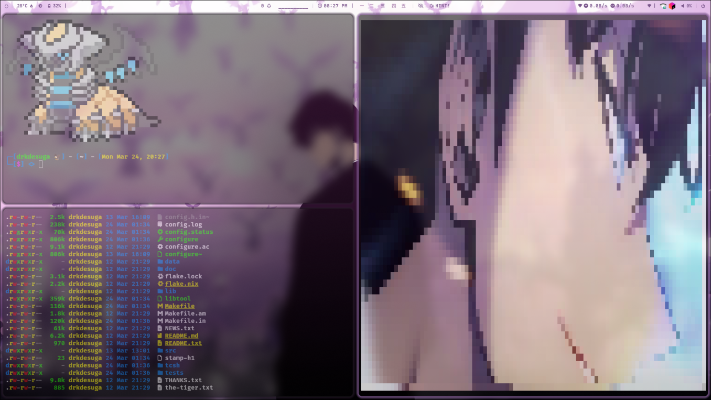

# Video Display in Pixel Art

This project allows you to display a video in pixel art format directly in the terminal using OpenCV.

## 📦 Dependencies

Before building the project, make sure you have OpenCV installed on your system.

On Debian-based systems (Ubuntu, Kali, etc.):
```bash
sudo apt update && sudo apt install libopencv-dev
```

On Arch Linux:
```bash
sudo pacman -S opencv
```

## 🔧 Build Instructions

To compile the project, use CMake:
```bash
cmake -S . -B build
cmake --build build
```

## ▶️ Running the Program

To display a video in ASCII format, use the following command:
```bash
./build/player <path-to-video>
```

Example:
```bash
./build/player video_store/sung_edit.mp4
```

This will display the video inside the terminal in real-time using pixel art.

## 🖼️ Screenshots

Here are some example screenshots of the output:

### Example 1:



