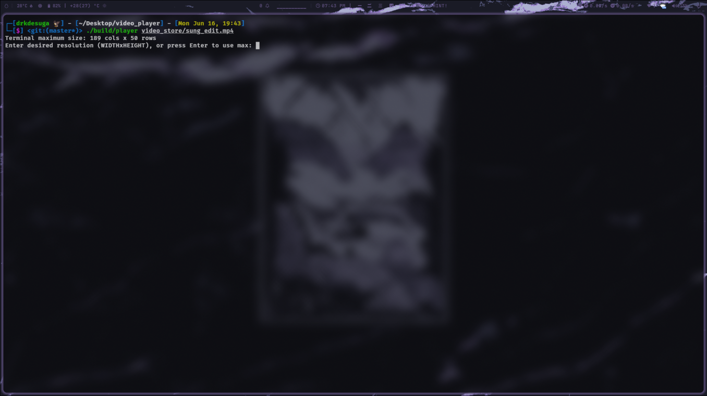
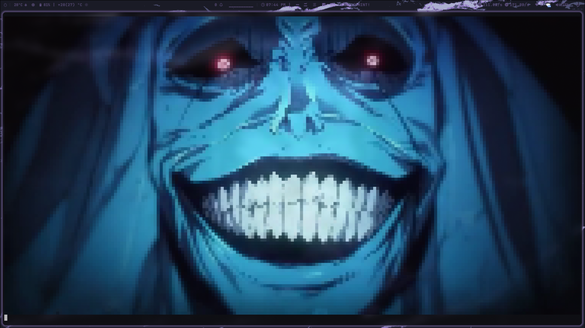
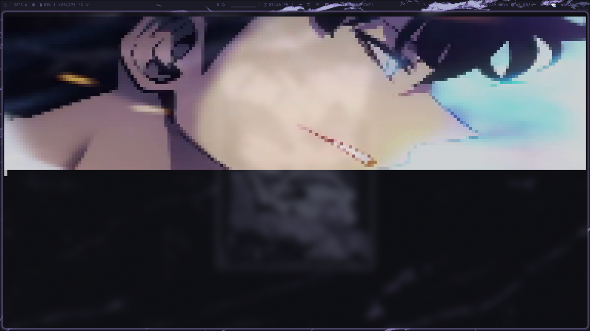

# Video Display in Pixel Art

This project displays a video in pixel art format directly in the terminal using OpenCV.

## 📦 Dependencies

Before building the project, ensure OpenCV is installed on your system.

**On Debian-based distributions (Ubuntu, etc.):**
```bash
sudo apt update && sudo apt install libopencv-dev
```

**On Arch Linux:**
```bash
sudo pacman -S opencv
```

## 🔧 Build Instructions

Compile the project with CMake:
```bash
cmake -S . -B build
cmake --build build
```

## ▶️ Running the Program

### Usage
```bash
./build/player <video-path> [WIDTHxHEIGHT]
```

- `<video-path>`: Path to the video file (e.g., `video_store/sung_edit.mp4`).
- `[WIDTHxHEIGHT]` (optional): Desired terminal resolution in **columns × rows**, for example `80x24`. If omitted, the program will display the maximum size and prompt you to enter a custom resolution or press **Enter** to use the maximum.

### Examples

1. **Interactive mode** (you’ll be prompted for resolution after seeing the maximum size):
   ```bash
   ./build/player video_store/sung_edit.mp4
   ```

2. **Direct mode** with fixed resolution:
   ```bash
   ./build/player video_store/sung_edit.mp4 80x24
   ```

## 🖼️ Screenshots

Below is an example screenshot of the output:

### Example:




